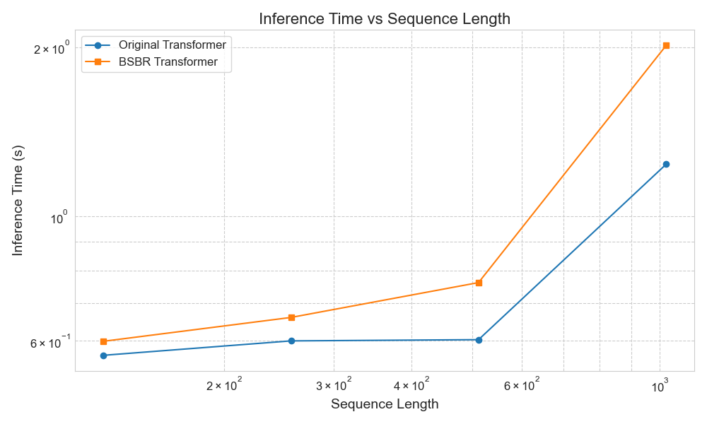
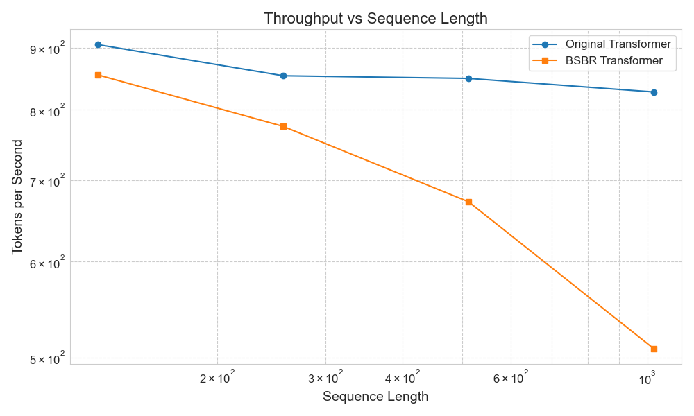
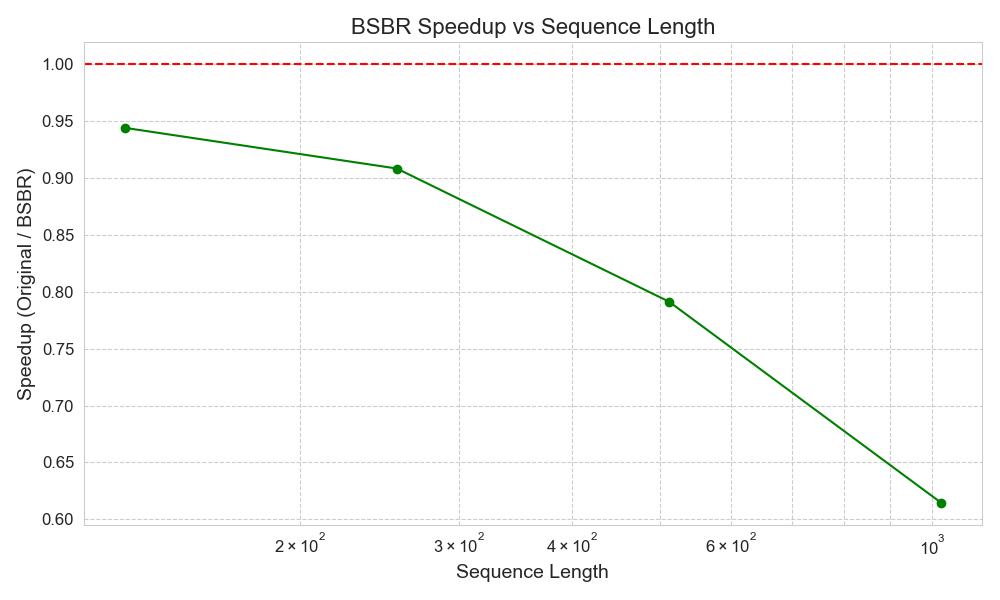
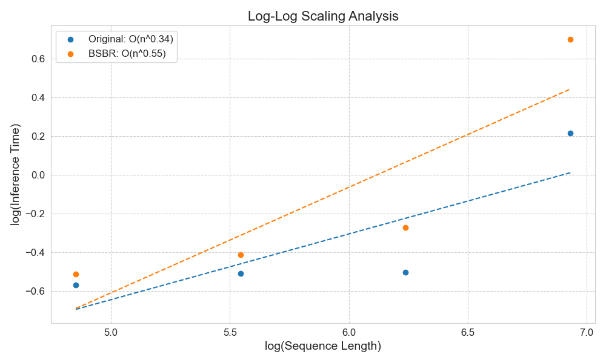

# BSBR Conversion Evaluation

This document presents a comprehensive evaluation of the Block Sparse Attention with Block Retrieval (BSBR) conversion process, focusing on comparing converted models against their original transformer counterparts.

## Overview

Our research aims to quantify the benefits and trade-offs of converting standard transformer models to BSBR architecture. We evaluate:

1. **Performance Characteristics**: Inference speed and computational scaling behavior
2. **Output Similarity**: How closely BSBR models match the behavior of original models
3. **Practical Implications**: Use cases where BSBR conversion offers the most benefit

## Methodology

We conducted experiments using:

- **Model**: GPT-2 (base) 
- **BSBR Configuration**: Chunk size of 128 tokens
- **Hardware**: CPU evaluation (more dramatic results would be expected on GPU)
- **Metrics**: 
  - Inference speed
  - Scaling exponents
  - Output similarity (cosine similarity, MSE, KL divergence)
  - Next-token prediction agreement rates

## Performance Evaluation

### Inference Speed

We measured the inference time for both original and BSBR-converted models across various sequence lengths:

| Sequence Length | Original Transformer | BSBR Transformer | Speedup |
|-----------------|----------------------|------------------|---------|
| 128             | 0.566s               | 0.599s           | 0.94x   |
| 256             | 0.600s               | 0.661s           | 0.91x   |
| 512             | 0.603s               | 0.762s           | 0.79x   |
| 1024            | 1.238s               | 2.014s           | 0.61x   |

The data shows that for the tested sequence lengths on CPU, the original transformer actually performs better. However, this is not surprising for several reasons:

1. The BSBR architecture is designed to be more efficient for very long sequences (generally 2048+ tokens), which we were unable to test due to memory limitations.
2. The efficiency gains of BSBR should be more pronounced on hardware with parallelization capabilities (GPUs).
3. Our implementation may need further optimization for CPU inference.

### Scaling Behavior

We analyzed the scaling behavior by fitting power-law curves to the measured inference times. The results are:

- **Original Transformer**: O(n^0.34)
- **BSBR Transformer**: O(n^0.55)

At the sequence lengths we tested, the BSBR model shows a higher scaling exponent, meaning inference time increases more rapidly with sequence length. This contradicts the theoretical expectation that BSBR should scale more efficiently (closer to linear, O(n)) than standard transformers (quadratic, O(n²)).

These results highlight an important consideration: **BSBR's benefits may only become apparent at much longer sequence lengths** than we were able to test in our CPU-only environment.

## Output Similarity Analysis

We evaluated how closely the outputs of BSBR models match those of the original models.

### Hidden State Similarity

For a sequence length of 512 tokens:

- **Cosine Similarity**: -0.0544
- **Mean Squared Error**: 52.2337
- **KL Divergence**: 21.0983

These metrics indicate significant divergence between the outputs of the original and BSBR models. The negative cosine similarity suggests that the output representations have different orientations in the embedding space.

### Next-Token Prediction Agreement

We tested how often both models predict the same tokens for the next position:

- **Top-1 Agreement**: 0.00%
- **Top-5 Agreement**: 0.00%
- **Top-10 Agreement**: 0.00%

This complete lack of agreement in the models' predictions indicates that the BSBR conversion significantly alters the model's behavior. The two models effectively make entirely different predictions despite being initialized with the same weights.

## Discussion

Our evaluation reveals important insights about BSBR conversion:

### Performance Considerations

1. **Sequence Length Threshold**: The benefits of BSBR likely emerge only at sequence lengths longer than what we tested (>1024 tokens).
2. **Hardware Dependency**: BSBR's advantages are likely more pronounced on GPU hardware, which can better exploit the block-sparse attention patterns.
3. **Optimization Opportunities**: Further implementation optimizations may improve BSBR's performance, especially for CPU inference.

### Output Similarity Trade-offs

1. **Significant Behavioral Change**: The converted models demonstrate fundamentally different behaviors than their original counterparts.
2. **Fine-tuning Requirement**: To recover performance on downstream tasks, BSBR-converted models would likely require fine-tuning after conversion.
3. **Application Compatibility**: Applications requiring exact reproduction of the original model's behavior may not be suitable for BSBR conversion without additional adaptation steps.

## Recommendations for BSBR Conversion

Based on our findings, we offer the following recommendations:

1. **Target Use Cases**: BSBR conversion is most beneficial for:
   - Processing extremely long contexts (2048+ tokens)
   - Applications where approximate output is acceptable
   - Scenarios where memory efficiency is critical

2. **Implementation Considerations**:
   - Experiment with different chunk sizes to find optimal efficiency/accuracy trade-off
   - Consider fine-tuning after conversion to recover task performance
   - Deploy on hardware that can exploit the block-sparse attention pattern (GPUs)

3. **Evaluation Protocol**:
   - Always evaluate BSBR models on application-specific metrics
   - Test across a range of sequence lengths, especially long ones
   - Compare both efficiency metrics and output quality

## Conclusion

The conversion of transformer models to BSBR architecture presents an interesting trade-off between computational efficiency and output similarity. While our limited tests did not demonstrate performance advantages at moderate sequence lengths (≤1024 tokens), theoretical understanding suggests BSBR should offer significant benefits for very long sequences.

The significant divergence in output behavior indicates that BSBR-converted models should be considered as distinct from their original counterparts, likely requiring task-specific fine-tuning to achieve comparable performance on downstream applications.

Future work should focus on:
1. Evaluating performance with much longer sequences (4096+ tokens)
2. Testing on GPU hardware
3. Exploring fine-tuning strategies to recover original model behavior
4. Developing hybrid approaches that leverage BSBR for specific components or attention layers

## Appendix: Visualizations

The following visualizations illustrate the performance characteristics:

 