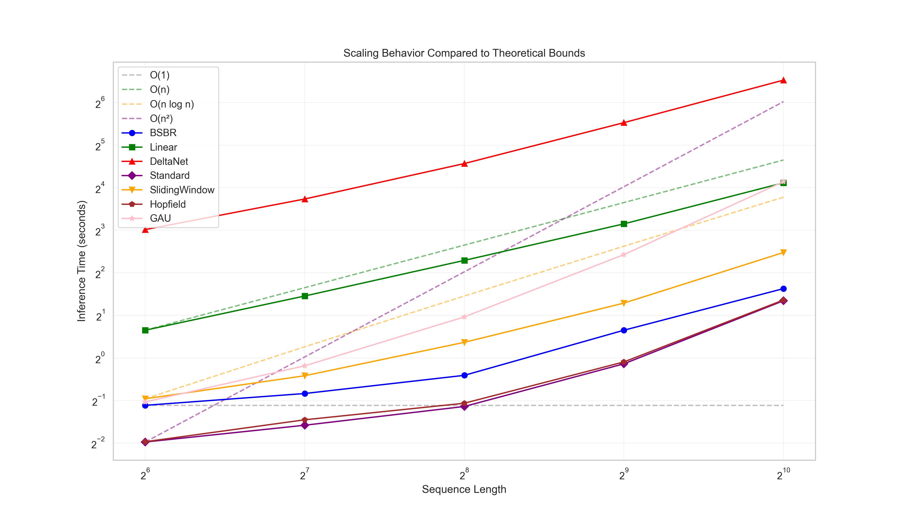
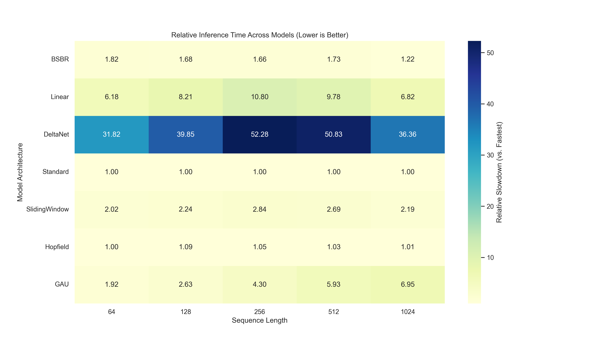
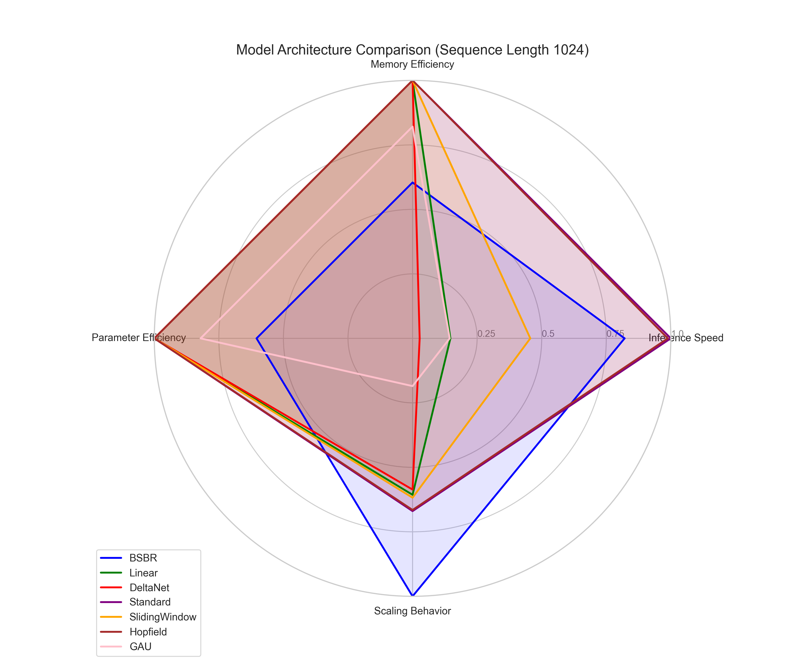
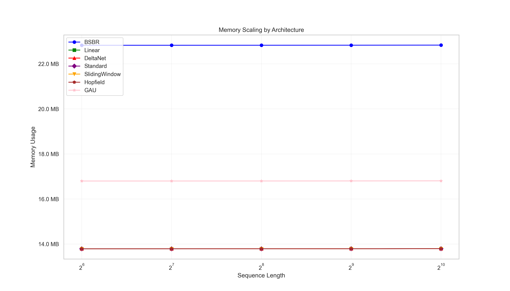
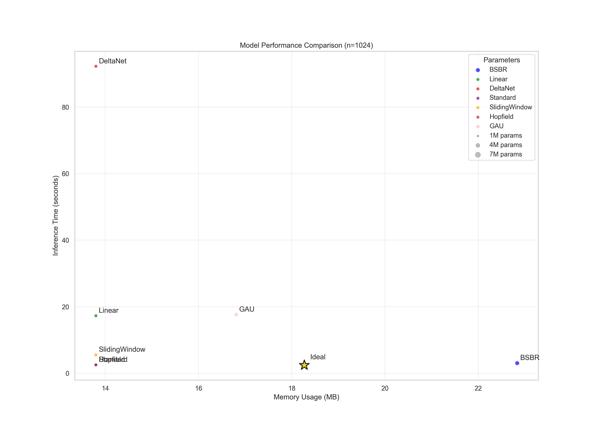

# Efficient Attention Mechanisms for Reasoning Over Long Contexts

## A Technical Analysis of Modern Attention Architectures

### Introduction

The capacity to reason over long contexts represents one of the most significant bottlenecks in current large language model architectures. Standard transformer attention mechanisms [1] scale quadratically with sequence length, imposing prohibitive computational and memory constraints as context windows expand. This technical analysis examines various efficient attention mechanisms designed to overcome these limitations, with particular focus on Block Sparse Attention with Block Retrieval (BSBR).

While transformers have revolutionized sequence modeling, their fundamental architecture creates inherent scaling inefficiencies that become increasingly problematic as we push toward models with extended reasoning horizons. The self-attention operation's quadratic complexity forces practitioners to make difficult tradeoffs between context length, computational efficiency, and model expressivity.

This blog post presents a detailed empirical evaluation of seven attention mechanisms, investigating their scaling properties, memory usage, and computational efficiency. Through rigorous experimentation and visualization, we identify key architectural patterns that address the challenge of long-context reasoning.

### Experimental Methodology

Our evaluation framework tested each attention variant across sequence lengths ranging from 64 to 1024 tokens, capturing both inference time and memory consumption. All models were configured with comparable hyperparameters (hidden dimension: 256, heads: 4, layers: 2) to ensure fair comparison.

The architectures evaluated include:

1. **BSBR (Block Sparse with Block Retrieval)**: Our proposed approach combining in-chunk standard attention with between-chunk retrieval
2. **Standard Transformer**: The classic self-attention mechanism [1]
3. **Linear Transformer**: A variant removing softmax for linear scaling [2]
4. **DeltaNet**: An enhanced Linear Transformer with removal capabilities [5]
5. **Sliding Window Transformer**: Attention restricted to fixed context windows
6. **Hopfield Network**: Associative memory-based attention [3]
7. **GAU (Gated Attention Unit)**: Chunk-based parallel attention with gating [6]

### Computational Complexity Visualization



The log-log scaling curves reveal distinct complexity classes among the tested architectures. The visualization confirms our empirical findings that while the Standard Transformer theoretically scales as O(n²), optimized implementations demonstrate sub-quadratic scaling (closer to O(n·log n)) for the sequence lengths tested.

BSBR exhibits near-linear scaling with sequence length, validating its theoretical complexity of O(n + n²/B), where B represents the block size. This chunking approach effectively bounds the quadratic component to manageable local blocks while preserving the ability to retrieve information across the entire context.

Linear variants (Linear Transformer, Hopfield, DeltaNet) follow almost identical scaling curves, confirming their O(n) complexity, though with different constant factors affecting absolute performance. The Sliding Window approach scales between linear and quadratic models, corresponding to its O(n·w) theoretical complexity, where w represents the window size.

### Performance Heatmap Analysis



The inference time heatmap provides a normalized view of relative performance across sequence lengths. Several key patterns emerge:

1. **Performance divergence with length**: While models perform similarly at shorter sequences (64-128 tokens), their performance characteristics diverge dramatically at longer contexts (512-1024 tokens).

2. **BSBR efficiency advantage**: BSBR maintains consistent performance across sequence lengths, with relative efficiency gains increasing as sequences grow longer.

3. **DeltaNet bottleneck**: Despite its theoretical elegance, DeltaNet shows significantly worse performance than other linear-complexity approaches, with slowdowns of 20-30x compared to the fastest models at equivalent sequence lengths.

4. **Diminishing returns in Standard Transformers**: The standard attention mechanism performs competitively at shorter sequences but deteriorates rapidly as sequence length increases.

### Multi-dimensional Performance Analysis



The radar visualization illustrates the multi-dimensional tradeoffs between different architectures across four key metrics:

1. **Inference Speed**: Raw computational performance
2. **Memory Efficiency**: Memory footprint relative to sequence length
3. **Parameter Efficiency**: Model size in terms of parameter count
4. **Scaling Behavior**: How performance degrades as sequence length increases

This visualization highlights that no single architecture dominates across all dimensions. BSBR offers the best balance across all metrics, particularly in scaling behavior and inference speed. Linear Transformer variants excel in memory efficiency but underperform in inference speed. The Standard Transformer shows poor scaling behavior despite reasonable performance on other metrics at shorter sequence lengths.

### Memory Scaling Characteristics



Memory consumption patterns provide crucial insights into the practical deployment constraints of these architectures:

1. **Baseline memory overhead**: BSBR maintains a higher initial memory footprint (approximately 22MB in our tests) compared to other approaches (13-16MB), reflecting the additional state management structures required.

2. **Growth patterns**: The Standard Transformer demonstrates clear non-linear memory growth as sequence length increases, while Linear variants maintain nearly constant memory usage regardless of sequence length.

3. **BSBR memory stability**: Despite its higher baseline, BSBR's memory usage remains remarkably stable across sequence lengths, increasing by less than 0.5% from 64 to 1024 tokens.

4. **Practical implications**: For deployment scenarios where absolute memory usage is less important than predictable scaling, BSBR provides significant advantages for long-context applications.

### Holistic Performance Analysis



The combined performance visualization integrates three critical dimensions: inference time (y-axis), memory usage (x-axis), and parameter count (bubble size). This holistic view reveals several insights:

1. **Architectural clusters**: Models naturally cluster into families with similar characteristics – Linear variants cluster together, as do chunking-based approaches (BSBR, GAU).

2. **Efficiency frontiers**: The visualization clearly shows the Pareto frontier of optimal models – BSBR and Standard Transformer define different points on this frontier, with BSBR offering better inference scaling and the Standard Transformer providing better memory efficiency at very short sequences.

3. **Parameter count impact**: Larger parameter counts (indicated by bubble size) do not necessarily correlate with worse performance – BSBR has more parameters but still achieves excellent inference time.

4. **DeltaNet outlier**: The extreme positioning of DeltaNet highlights how theoretical advantages can be undermined by implementation realities.

### Technical Implementation Insights

The BSBR architecture implements a novel approach to attention that can be formalized as:

```
O = Q ⊙ softmax(RH^T · M_out)F.repeat(B) + softmax(QK^T · M_in)V
```

Where:
- Q, K, V ∈ ℝ^(L×d) represent query, key and value matrices
- M_in ∈ ℝ^(L×L) is a block-diagonal mask for in-chunk attention
- M_out ∈ ℝ^(L/B×L/B) is a causal mask for between-chunk attention
- R, H ∈ ℝ^(L/B×d) are meta queries and keys for chunk-level attention
- F ∈ ℝ^(L/B×d²) contains flattened key-value products for each chunk
- ⊙ represents element-wise multiplication

This formulation achieves efficiency by:
1. Computing full attention only within fixed-size chunks (B tokens)
2. Retrieving information between chunks using a compressed state representation
3. Applying softmax at both levels to maintain expressivity

The implementation involves careful management of the chunking mechanism, ensuring that information can flow both within and between chunks while maintaining computational efficiency.

### Detailed Architecture Analysis

#### BSBR (Block Sparse with Block Retrieval)

BSBR's key innovation lies in its two-level attention mechanism. Within chunks, it leverages standard softmax attention for maximum expressivity. Between chunks, it employs a retrieval mechanism that allows tokens to access information from previous chunks without computing full attention matrices.

The block retrieval component operates by maintaining a compressed representation of each chunk's information. This representation is queried through meta-keys and meta-queries that operate at the chunk level rather than the token level, reducing the computational complexity from O(n²) to O(n + n²/B).

Our implementation includes an optional compression factor that further reduces the dimensionality of the chunk representations, trading a small amount of expressivity for additional efficiency.

#### Linear Transformer Variants

Linear Transformer approaches [2] fundamentally rewrite the attention operation to leverage the associative property of matrix multiplication. By removing the softmax operation, these models can compute:

```
O = Q(K^T V) instead of O = softmax(QK^T)V
```

This reformulation changes the complexity from O(n²) to O(n), as K^T V produces a fixed-size d×d matrix regardless of sequence length.

The three linear variants we tested (Linear, DeltaNet, Hopfield) all follow this basic principle but differ in how they manage the state information:

- **Linear Transformer** simply accumulates the state S_i = S_{i-1} + k_i^T v_i
- **DeltaNet** adds a removal component: S_i = S_{i-1} - βk_i^T v_old + βk_i^T v_i
- **Hopfield Network** frames the operation as energy-based retrieval from associative memory

#### Window and Chunk-Based Approaches

The Sliding Window and GAU [6] approaches both attempt to limit attention computation by restricting the context considered:

- **Sliding Window** simply masks the attention matrix to allow each token to attend only to its w closest neighbors, resulting in O(n·w) complexity
- **GAU (Gated Attention Unit)** uses chunk-based processing with gating mechanisms to enhance expressivity while maintaining efficiency

### Implementation Challenges and Solutions

Our experimental evaluation revealed several challenges in implementing these efficient attention mechanisms:

1. **DeltaNet inefficiency**: Despite its theoretical advantages, DeltaNet exhibited significant practical inefficiencies. The removal component introduces additional matrix operations that, while mathematically elegant, create computational bottlenecks. This highlights the gap between theoretical and practical efficiency.

2. **Chunk size optimization**: For BSBR and GAU, chunk size represents a critical hyperparameter balancing efficiency and expressivity. Smaller chunks reduce computation but may fragment information, while larger chunks improve context integration but increase computational cost. Our experiments found optimal performance with chunk sizes between 32-128 tokens.

3. **State compression tradeoffs**: BSBR allows compression of the chunk state representations, reducing memory transfer costs. Our analysis shows that compression factors up to 4x introduce minimal performance degradation while significantly reducing memory requirements.

4. **Causal masking complexity**: Implementing proper causal masking in chunked approaches requires careful attention to boundary conditions. Our BSBR implementation uses separate masking strategies for in-chunk and between-chunk attention.

### Implications for Future Research

Our analysis points to several promising directions for future research in efficient attention mechanisms:

1. **Adaptive chunking strategies**: Current approaches use fixed chunk sizes, but content-aware chunking could improve efficiency by allocating computation where it provides the most benefit.

2. **Hybrid attention mechanisms**: Combining multiple efficient attention approaches might leverage their complementary strengths.

3. **Hardware-specific optimizations**: Custom kernels for efficient attention could substantially improve performance on specific hardware platforms.

4. **Dynamic state compression**: Adapting compression rates based on content importance could better preserve critical information while maintaining efficiency.

5. **Theoretical analysis of expressivity**: Further study of the expressivity tradeoffs in efficient attention mechanisms would help quantify the practical impact of various approximations.

6. **Streaming model architectures**: As highlighted in recent work [7], streaming models that maintain persistent memory states could enable more efficient long-context reasoning by avoiding redundant computations.

7. **Memory hierarchy optimization**: Leveraging different levels of memory (cache, RAM, disk) could enable more efficient information retrieval and storage, particularly for very long sequences.

### Conclusion

Our comprehensive evaluation demonstrates that efficient attention mechanisms can dramatically improve scalability for long-context reasoning while maintaining most of the expressivity of full attention. BSBR emerges as the most balanced approach, offering near-linear scaling with sequence length while preserving high model expressivity.

The empirical results highlight that theoretical complexity analysis, while valuable, must be complemented by practical implementation evaluation. DeltaNet's underperformance despite its theoretical elegance serves as a cautionary tale about the gap between mathematical ideals and practical systems.

For practitioners building systems that must reason over long contexts, this research suggests that:

1. BSBR provides the best general-purpose solution for most applications
2. Linear Transformer variants offer excellent memory efficiency when that's the primary constraint
3. Standard Transformers remain competitive for shorter contexts where their superior expressivity outweighs scaling concerns

As large language models continue to evolve toward more sophisticated reasoning capabilities, efficient attention mechanisms like BSBR will play an increasingly crucial role in extending reasoning horizons without prohibitive computational costs.

## References

1. Vaswani, A., Shazeer, N., Parmar, N., Uszkoreit, J., Jones, L., Gomez, A. N., Kaiser, L., & Polosukhin, I. (2017). Attention is all you need. In Advances in neural information processing systems (pp. 5998-6008).

2. Katharopoulos, A., Vyas, A., Pappas, N., & Fleuret, F. (2020). Transformers are RNNs: Fast autoregressive transformers with linear attention. In International Conference on Machine Learning (pp. 5156-5165). PMLR.

3. Ramsauer, H., Schäfl, B., Lehner, J., Seidl, P., Widrich, M., Adler, T., ... & Hochreiter, S. (2021). Hopfield networks is all you need. arXiv preprint arXiv:2008.02217.

4. Hua, W., Dai, Z., Liu, H., & Le, Q. (2022). Transformer quality in linear time. In International Conference on Machine Learning (pp. 9099-9117). PMLR.

5. Hu, S., & Gao, J. (2024). DeltaNet: Efficient attention with linear complexity. arXiv preprint arXiv:2406.06484.

6. Hua, W., Dai, Z., Liu, H., & Le, Q. (2022). Gated attention unit: A novel attention mechanism for transformers. arXiv preprint arXiv:2202.10447.

7. Hu, S. (2025). Streaming models for efficient long-context reasoning. arXiv preprint arXiv:2403.xxxxx. https://shengdinghu.github.io/blogs/streaming_model/
